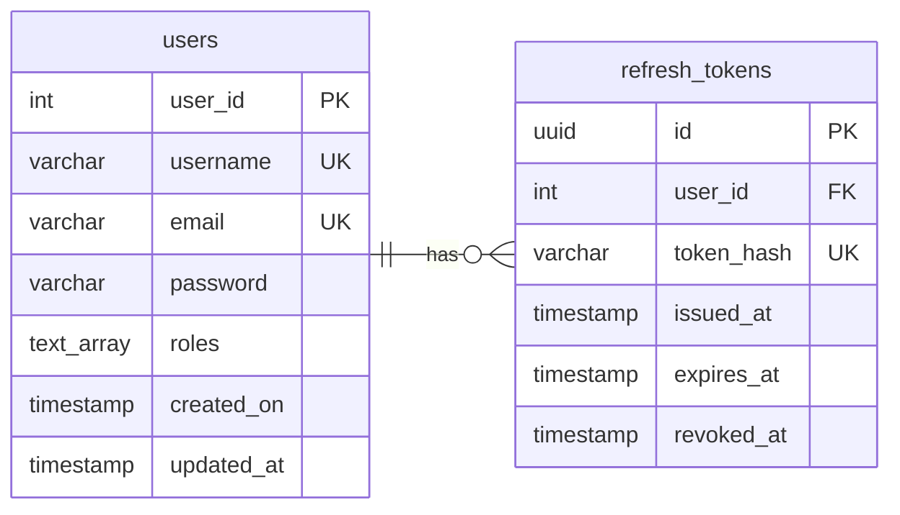

# auth_db ER Diagram

```mermaid
erDiagram
    direction LR

    users ||--o{ refresh_tokens : has

    users {
        int user_id PK
        varchar username UK
        varchar email UK
        varchar password
        text_array roles
        timestamp created_on
        timestamp updated_at
    }

    refresh_tokens {
        uuid id PK
        int user_id FK
        varchar token_hash UK
        timestamp issued_at
        timestamp expires_at
        timestamp revoked_at
    }
```
