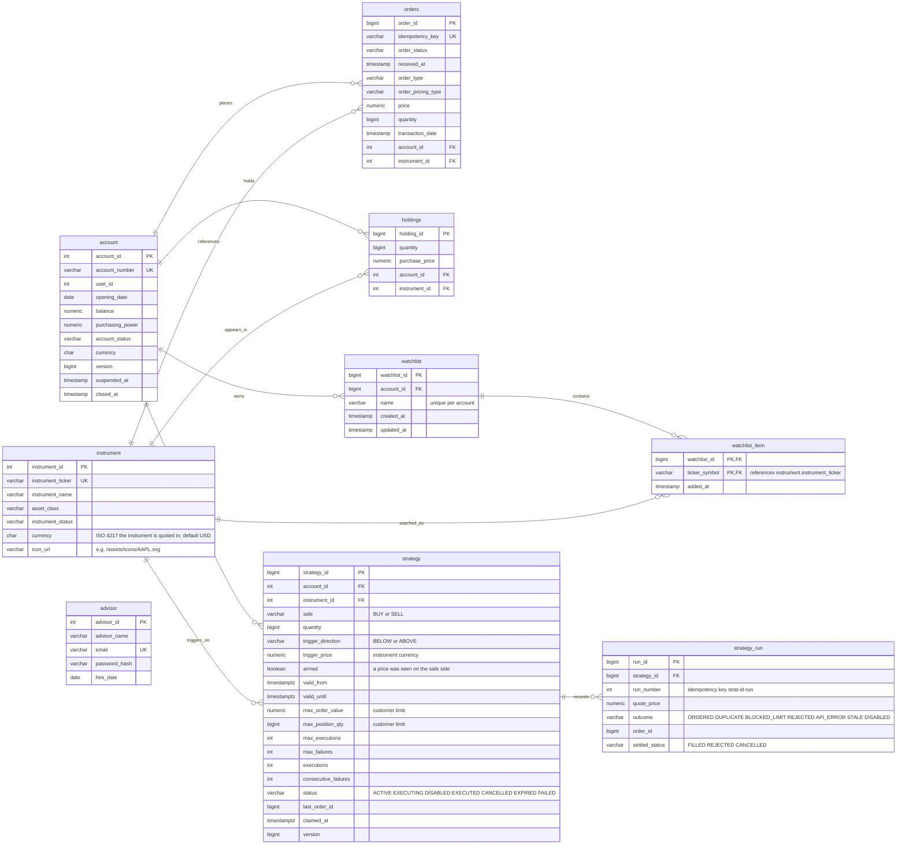

# trading_db ER Diagram

```mermaid
erDiagram
    direction LR

    account ||--o{ orders : places
    instrument ||--o{ orders : references
    account ||--o{ holdings : holds
    instrument ||--o{ holdings : appears_in
    account ||--o{ watchlist : owns
    watchlist ||--o{ watchlist_item : contains
    instrument ||--o{ watchlist_item : watched_as
    account ||--o{ strategy : sets
    instrument ||--o{ strategy : triggers_on
    strategy ||--o{ strategy_run : records

    strategy {
        bigint strategy_id PK
        int account_id FK
        int instrument_id FK
        varchar side "BUY or SELL"
        bigint quantity
        varchar trigger_direction "BELOW or ABOVE"
        numeric trigger_price "instrument currency"
        boolean armed "a price was seen on the safe side"
        timestamptz valid_from
        timestamptz valid_until
        numeric max_order_value "customer limit"
        bigint max_position_qty "customer limit"
        int max_executions
        int max_failures
        int executions
        int consecutive_failures
        varchar status "ACTIVE EXECUTING DISABLED EXECUTED CANCELLED EXPIRED FAILED"
        bigint last_order_id
        timestamptz claimed_at
        bigint version
    }

    strategy_run {
        bigint run_id PK
        bigint strategy_id FK
        int run_number "idempotency key strat-id-run"
        numeric quote_price
        varchar outcome "ORDERED DUPLICATE BLOCKED_LIMIT REJECTED API_ERROR STALE DISABLED"
        bigint order_id
        varchar settled_status "FILLED REJECTED CANCELLED"
    }

    advisor {
        int advisor_id PK
        varchar advisor_name
        varchar email UK
        varchar password_hash
        date hire_date
    }

    account {
        int account_id PK
        varchar account_number UK
        int user_id
        date opening_date
        numeric balance
        numeric purchasing_power
        varchar account_status
        char currency
        bigint version
        timestamp suspended_at
        timestamp closed_at
    }

    instrument {
        int instrument_id PK
        varchar instrument_ticker UK
        varchar instrument_name
        varchar asset_class
        varchar instrument_status
        char currency "ISO 4217 the instrument is quoted in; default USD"
        varchar icon_url "e.g. /assets/icons/AAPL.svg"
    }

    orders {
        bigint order_id PK
        varchar idempotency_key UK
        varchar order_status
        timestamp received_at
        varchar order_type
        varchar order_pricing_type
        numeric price
        bigint quantity
        timestamp transaction_date
        int account_id FK
        int instrument_id FK
    }

    holdings {
        bigint holding_id PK
        bigint quantity
        numeric purchase_price
        int account_id FK
        int instrument_id FK
    }

    watchlist {
        bigint watchlist_id PK
        bigint account_id FK
        varchar name "unique per account"
        timestamp created_at
        timestamp updated_at
    }

    watchlist_item {
        bigint watchlist_id PK, FK
        varchar ticker_symbol PK, FK "references instrument.instrument_ticker"
        timestamp added_at
    }
```
