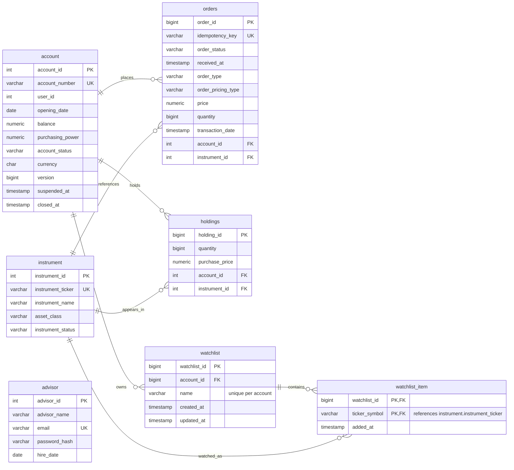

# trading_db ER Diagram

```mermaid
erDiagram
    direction LR

    account ||--o{ orders : places
    instrument ||--o{ orders : references
    account ||--o{ holdings : holds
    instrument ||--o{ holdings : appears_in
    account ||--o{ watchlist : owns
    watchlist ||--o{ watchlist_item : contains
    instrument ||--o{ watchlist_item : watched_as

    advisor {
        int advisor_id PK
        varchar advisor_name
        varchar email UK
        varchar password_hash
        date hire_date
    }

    account {
        int account_id PK
        varchar account_number UK
        int user_id
        date opening_date
        numeric balance
        numeric purchasing_power
        varchar account_status
        char currency
        bigint version
        timestamp suspended_at
        timestamp closed_at
    }

    instrument {
        int instrument_id PK
        varchar instrument_ticker UK
        varchar instrument_name
        varchar asset_class
        varchar instrument_status
    }

    orders {
        bigint order_id PK
        varchar idempotency_key UK
        varchar order_status
        timestamp received_at
        varchar order_type
        varchar order_pricing_type
        numeric price
        bigint quantity
        timestamp transaction_date
        int account_id FK
        int instrument_id FK
    }

    holdings {
        bigint holding_id PK
        bigint quantity
        numeric purchase_price
        int account_id FK
        int instrument_id FK
    }

    watchlist {
        bigint watchlist_id PK
        bigint account_id FK
        varchar name "unique per account"
        timestamp created_at
        timestamp updated_at
    }

    watchlist_item {
        bigint watchlist_id PK, FK
        varchar ticker_symbol PK, FK "references instrument.instrument_ticker"
        timestamp added_at
    }
```
